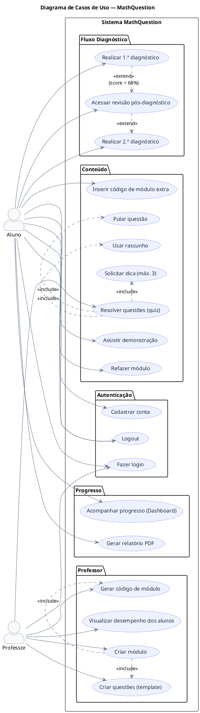
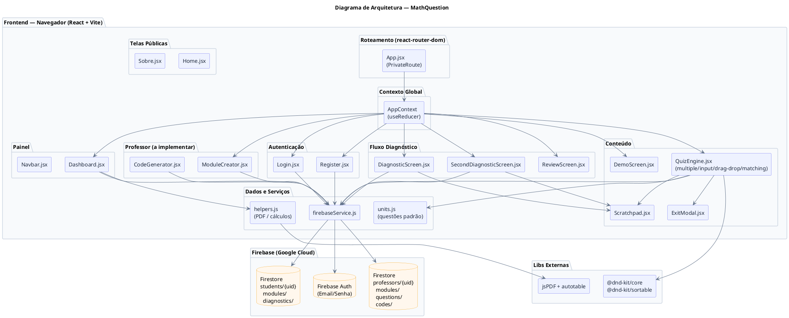
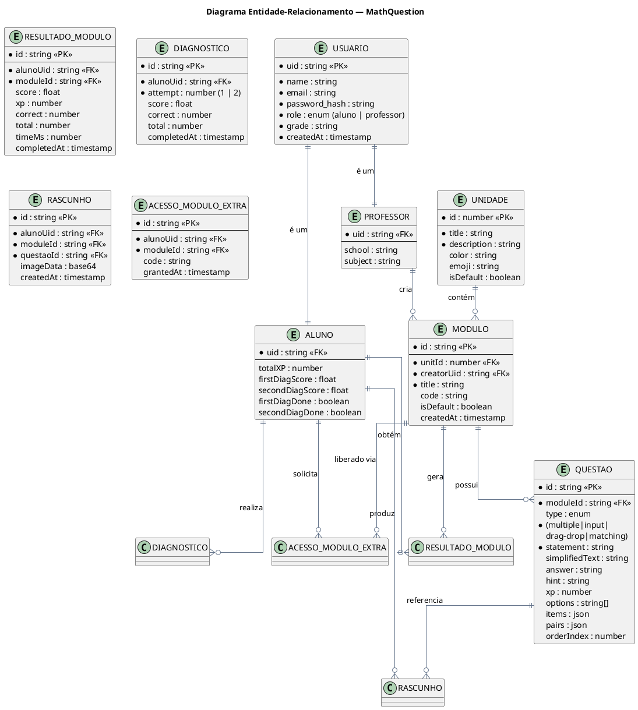

# Diagramas PlantUML — MathQuestion

## 1. Diagrama de Casos de Uso

```plantuml
@startuml casos_de_uso
skinparam actorStyle awesome
skinparam usecase {
  BackgroundColor #EEF2FF
  BorderColor #6366F1
  FontColor #1E293B
  ArrowColor #64748B
}
skinparam actor {
  BackgroundColor #F8FAFC
  BorderColor #475569
}

left to right direction
title Diagrama de Casos de Uso — MathQuestion

actor "Aluno" as A
actor "Professor" as P

rectangle "Sistema MathQuestion" {

  package "Autenticação" {
    usecase "Cadastrar conta" as UC01
    usecase "Fazer login" as UC02
    usecase "Logout" as UC03
  }

  package "Fluxo Diagnóstico" {
    usecase "Realizar 1.º diagnóstico" as UC04
    usecase "Acessar revisão pós-diagnóstico" as UC05
    usecase "Realizar 2.º diagnóstico" as UC06
  }

  package "Conteúdo" {
    usecase "Assistir demonstração" as UC07
    usecase "Resolver questões (quiz)" as UC08
    usecase "Usar rascunho" as UC09
    usecase "Solicitar dica (máx. 3)" as UC10
    usecase "Pular questão" as UC11
    usecase "Refazer módulo" as UC12
    usecase "Inserir código de módulo extra" as UC13
  }

  package "Progresso" {
    usecase "Acompanhar progresso (Dashboard)" as UC14
    usecase "Gerar relatório PDF" as UC15
  }

  package "Professor" {
    usecase "Criar módulo" as UC16
    usecase "Criar questões (template)" as UC17
    usecase "Gerar código de módulo" as UC18
    usecase "Visualizar desempenho dos alunos" as UC19
  }
}

' Aluno
A --> UC01
A --> UC02
A --> UC03
A --> UC04
A --> UC05
A --> UC06
A --> UC07
A --> UC08
A --> UC12
A --> UC13
A --> UC14
A --> UC15

' Professor
P --> UC02
P --> UC03
P --> UC16
P --> UC17
P --> UC18
P --> UC19

' includes
UC08 .> UC09 : <<include>>
UC08 .> UC10 : <<include>>
UC08 .> UC11 : <<include>>
UC16 .> UC17 : <<include>>
UC16 .> UC18 : <<include>>

' extends
UC04 .> UC05 : <<extend>>\n(score < 60%)
UC05 .> UC06 : <<extend>>

@enduml
```

---

## 2. Diagrama de Componentes / Arquitetura Geral

```plantuml
@startuml arquitetura
skinparam componentStyle rectangle
skinparam component {
  BackgroundColor #EEF2FF
  BorderColor #6366F1
  FontColor #1E293B
}
skinparam database {
  BackgroundColor #FFF7ED
  BorderColor #F59E0B
}
skinparam package {
  BackgroundColor #F8FAFC
  BorderColor #CBD5E1
}
skinparam ArrowColor #64748B

title Diagrama de Arquitetura — MathQuestion

package "Frontend — Navegador (React + Vite)" {

  package "Contexto Global" {
    [AppContext\n(useReducer)] as CTX
  }

  package "Roteamento (react-router-dom)" {
    [App.jsx\n(PrivateRoute)] as ROUTER
  }

  package "Telas Públicas" {
    [Home.jsx] as HOME
    [Sobre.jsx] as SOBRE
  }

  package "Autenticação" {
    [Login.jsx] as LOGIN
    [Register.jsx] as REG
  }

  package "Fluxo Diagnóstico" {
    [DiagnosticScreen.jsx] as D1
    [ReviewScreen.jsx] as REV
    [SecondDiagnosticScreen.jsx] as D2
  }

  package "Conteúdo" {
    [DemoScreen.jsx] as DEMO
    [QuizEngine.jsx\n(multiple/input/drag-drop/matching)] as QUIZ
    [Scratchpad.jsx] as SCRAP
    [ExitModal.jsx] as EXIT
  }

  package "Painel" {
    [Dashboard.jsx] as DASH
    [Navbar.jsx] as NAV
  }

  package "Professor (a implementar)" {
    [ModuleCreator.jsx] as PROF
    [CodeGenerator.jsx] as CODE
  }

  package "Dados e Serviços" {
    [units.js\n(questões padrão)] as UNITS
    [firebaseService.js] as SVC
    [helpers.js\n(PDF / cálculos)] as HELP
  }
}

package "Libs Externas" {
  [jsPDF + autotable] as PDF
  [@dnd-kit/core\n@dnd-kit/sortable] as DND
}

package "Firebase (Google Cloud)" {
  database "Firebase Auth\n(Email/Senha)" as AUTH
  database "Firestore\nstudents/{uid}\n  modules/\n  diagnostics/" as FS
  database "Firestore\nprofessors/{uid}\n  modules/\n  questions/\n  codes/" as FSP
}

' Fluxo principal
ROUTER --> CTX
CTX --> LOGIN
CTX --> REG
CTX --> D1
CTX --> D2
CTX --> REV
CTX --> DEMO
CTX --> QUIZ
CTX --> DASH
CTX --> PROF

' Dependências de componentes
QUIZ --> SCRAP
QUIZ --> EXIT
QUIZ --> DND
QUIZ --> UNITS
D1 --> SCRAP
D2 --> SCRAP
DASH --> HELP
HELP --> PDF

' Serviço Firebase
LOGIN --> SVC
REG --> SVC
D1 --> SVC
D2 --> SVC
QUIZ --> SVC
DASH --> SVC
PROF --> SVC
CODE --> SVC

' Firebase
SVC --> AUTH
SVC --> FS
SVC --> FSP

@enduml
```

---

## 3. Diagrama Entidade-Relacionamento (DER)

```plantuml
@startuml der
skinparam entity {
  BackgroundColor #EEF2FF
  BorderColor #6366F1
  FontColor #1E293B
}
skinparam ArrowColor #64748B
skinparam linetype ortho

title Diagrama Entidade-Relacionamento — MathQuestion

entity "USUARIO" as USR {
  * uid : string <<PK>>
  --
  * name : string
  * email : string
  * password_hash : string
  * role : enum (aluno | professor)
  * grade : string
  * createdAt : timestamp
}

entity "ALUNO" as ALU {
  * uid : string <<FK>>
  --
  totalXP : number
  firstDiagScore : float
  secondDiagScore : float
  firstDiagDone : boolean
  secondDiagDone : boolean
}

entity "PROFESSOR" as PROF {
  * uid : string <<FK>>
  --
  school : string
  subject : string
}

entity "UNIDADE" as UNIT {
  * id : number <<PK>>
  --
  * title : string
  * description : string
  color : string
  emoji : string
  isDefault : boolean
}

entity "MODULO" as MOD {
  * id : string <<PK>>
  --
  * unitId : number <<FK>>
  * creatorUid : string <<FK>>
  * title : string
  code : string
  isDefault : boolean
  createdAt : timestamp
}

entity "QUESTAO" as QUEST {
  * id : string <<PK>>
  --
  * moduleId : string <<FK>>
  * type : enum\n(multiple|input|\ndrag-drop|matching)
  * statement : string
  simplifiedText : string
  answer : string
  hint : string
  xp : number
  options : string[]
  items : json
  pairs : json
  orderIndex : number
}

entity "RESULTADO_MODULO" as RMOD {
  * id : string <<PK>>
  --
  * alunoUid : string <<FK>>
  * moduleId : string <<FK>>
  score : float
  xp : number
  correct : number
  total : number
  timeMs : number
  completedAt : timestamp
}

entity "DIAGNOSTICO" as DIAG {
  * id : string <<PK>>
  --
  * alunoUid : string <<FK>>
  * attempt : number (1 | 2)
  score : float
  correct : number
  total : number
  completedAt : timestamp
}

entity "RASCUNHO" as RASC {
  * id : string <<PK>>
  --
  * alunoUid : string <<FK>>
  * moduleId : string <<FK>>
  * questaoId : string <<FK>>
  imageData : base64
  createdAt : timestamp
}

entity "ACESSO_MODULO_EXTRA" as ACESSO {
  * id : string <<PK>>
  --
  * alunoUid : string <<FK>>
  * moduleId : string <<FK>>
  code : string
  grantedAt : timestamp
}

' Herança de usuário
USR ||--|| ALU : "é um"
USR ||--|| PROF : "é um"

' Relacionamentos principais
PROF ||--o{ MOD : "cria"
UNIT ||--o{ MOD : "contém"
MOD ||--o{ QUEST : "possui"

ALU ||--o{ RESULTADO_MODULO : "obtém"
MOD ||--o{ RESULTADO_MODULO : "gera"

ALU ||--o{ DIAGNOSTICO : "realiza"
ALU ||--o{ RASCUNHO : "produz"
ALU ||--o{ ACESSO_MODULO_EXTRA : "solicita"
MOD ||--o{ ACESSO_MODULO_EXTRA : "liberado via"

QUEST ||--o{ RASCUNHO : "referencia"

@enduml
```
